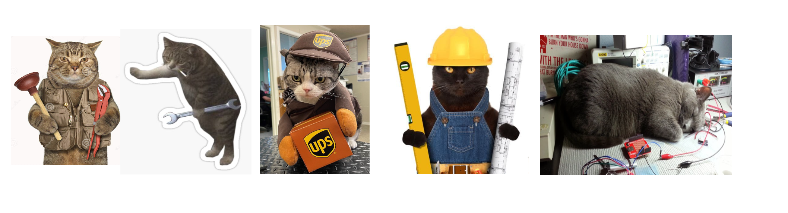
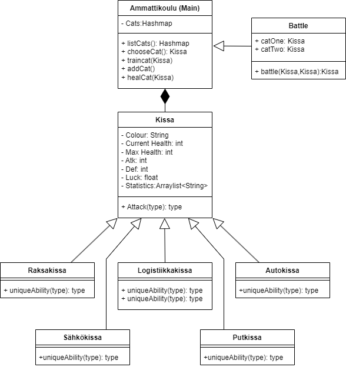

# Ammattikissat

Ammattikissat on yksinkertainen taistelupeli ammatti aiheisten kissojen kanssa.

## About

Ammattikissa pelissä pelaajalla on kissoja joita hän voi kouluttaa tai terveyttää, sekä joiden kanssa pelaaja voi taistella tietokonetta vastaan. Ohjelma koostuu kolmesta eri pääfragmentista: kissat, tiedot ja taistelu. Pelaaja valistee kissan painamalla sitä kissa näytössä, jonka jälkeen pelaaja voi mennä tiedeot näyttöön kastomaan kissan tilastoja, sekä suorittamaan terveyttämistä tai treenaamista. Pelaaja voi myös mennä taisteluun ja taistella tietokonetta vastaan. Valittu kissa pysyy valittuna kunnes uusi kissa valitaan.

### Omat ominaisuudet
Päätimme hieman laajentaa vaadittua tehtävänantoa lisäämällä muutamia omia ominaisuuksia. Näihin kuuluu elämäpistepalkit, tietokonevastustaja, todellinen pelaaminen, AI generoidut kissakuvat, kissojen uniikit omat kyvyt ja taustamusiikki.

#### Elämäpistepalkit
Kaikissa näytöissä sekä pelaajan omien kissojen, että tarvittaessa vastustajan kissan elämäpisteet on visuaalisesti esitetty elämäpistepalkilla, joka päivittyy reaaliajassa.

#### Tietokonevastustaja ja todellinen pelaaminen
Taistelu ei ole simuloitu kahden tietokoneen välillä niinkuin, tehtävänannossa suositelttiin toteuttaamaan. Tämän sijaan taistelunäkymässä pelaaja saa taistelupeleille tyypillisesti valita mitä tekee, jonka jälkeen tietokone vastaa painontetulla satunnaiseti valitulla arvolla samoista vaihtoehdoista.

#### AI generoidut kissakuvat
Kissojen kuvat on generoitu AI:n avulla uniikin ja hyvän ulkonäön saavuttamiseksi.

#### Kissojen uniikit omat kyvyt.
Jokaisella kissalla on uniikki kyky joita sekä pelaaja, että vastustaja voi käyttää. Näiden uniikkien kykyjen tarkemmat tiedot löytyy alhaalta kissojen statiikoista.

#### Taustamusiikki
Pelissä on pirteä taustamusiikki parantamassa pelikokemusta.
[YouTube](https://www.youtube.com/watch?v=DzFXGsRvSwA)

### Demo
Tässä demovideo proejektista: 

## Pelimekaniikat
### Tuuri
Pelissä on luck/tuuri/onni. Tämä esiintyy sillä, että hyökätessä todennäköisyys kriittiseen osumaan (2 extra hyökkäys pistettä kyseiseen hyökkäykseen) lasketatan onnesta kaavalla: random.nextInt(10)+luck > 6 .Siten siis todennäköisyys on 33% + tuurin aiheuttama painotus

### Vahingonotto 
Pelissä vahingonotto noudattaa seuraavaa kaavaa damage = AttackDamage-(DefencePower/2)

### Treenaus:
Treenaus kasvattaa satunnaisesti joko maksimi elämäpisteitä, puollustusta tai hyökkäystä. Treenaus on rajoitettu siten, että jokaista kissaa voi treenata 2 kertaa ja jokainen voitto tienaa kaksi uutta treenaus mahdollisuutta.

## Kissojen statiikat:

### Töikissa (Raksa):
- 20 hp
- 4 atk
- 6 def
- 1 lck
#### Ability:
- Terveytä maksimissaan 4 elämäpistettä.

### Putkissa (LVI-kissa):
- 24 hp
- 6 atk
- 8 def
- 0 lck
#### Ability:
- Vaihda yksi attack piste yhteen defenceen

### Logiskiskiskistiikka (Logistiikka): high skill low stat
- 14 hp
- 3 atk
- 4 def
- 2 lck
#### Ability:
- 2 extra hyökkäys pistettä seuraavaksi kahdeksi vuoroksi

### Sähkökisse (Sähkö)
- 20 hp
- 5 atk
- 2 def
- 1 lck
#### Ability:
- Kasvata hyökkäystä viidellä pisteellä, viiden elämäpisteen kustannuksella

### Autokissa (Auto)
- 18 hp
- 8 atk
- 4 def
- 0 lck
#### Ability:
- Kasvata tuuria kolmella yhden vuoron ajaksi

## License

MIT License Copyright (c) [2023] [Kolmen Hengen Tyhmä]

## Legal

Project artwork created using Hotpot.ai

